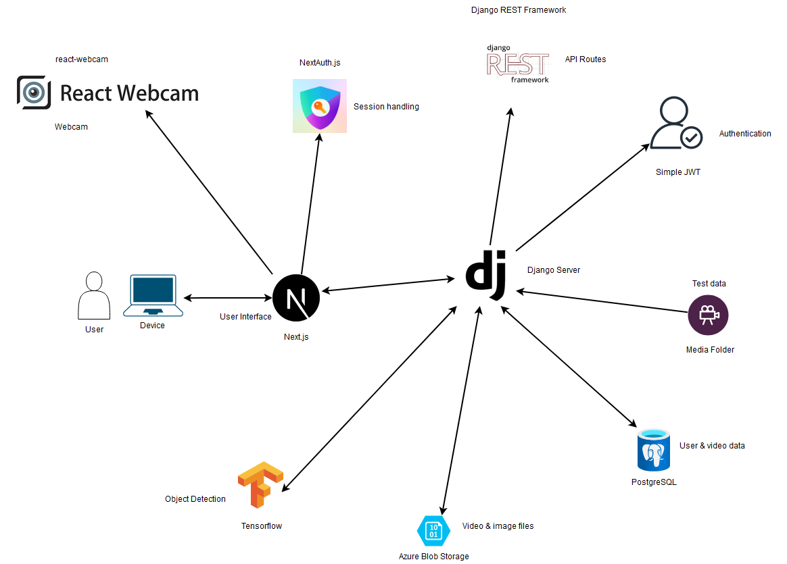
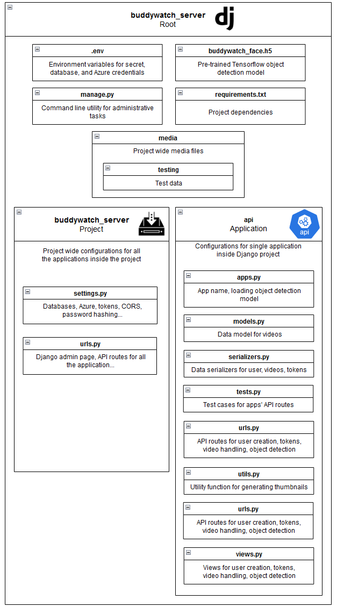

# BuddyWatch Django Server

|          |               |
| :------: | :-----------: |
| Document | Documentation |
| Author:  |    Nakkeez    |
| Version: |      1.0      |
|  Date:   |   29.9.2024   |

BuddyWatch is a deep learning enhanced surveillance system application for detecting humans from webcam feed. The software has separate user interface and server side applications working together to provide the functionality to the user.

The server is built using Django framework and Python 3.10. The server uses PostgreSQL database for storing information like user data and video information such as title, creation time, and owner. Videos themself are stored in Azure Blob Storage. When the server is started, it loads pre-trained Tensorflow object detection model to memory. Django was chosen for the server side because of the project's focus on object detection. Most deep learning libraries are built for Python, so using Django resulted in seamless integration of Tensorflow. Django's many built-in middleware's for security and error handling also make sure that the server will handle password hashing and invalid inputs with grace.

The object detection model has been developed using Keras Functional API with JupyterLab. VGG16 model was used as a base, and a new classification layer for detecting faces was built on top of it. The model was trained with a set of webcam images. Currently, the webcam images are from very specific environment and the model will most likely perform very poorly in other environments because of this.

Here you can find the public GitHub repository for the [Tensosflow Object Detection Model](https://github.com/nakkeez/buddywatch-object-detection "The object detection repository for the BuddyWatch").

The user interface is built with Next.js React framework using TypeScript. It uses the webcam of the user's device to capture images and videos, and provides functionality to send them to the server in order to be stored or processed by object detection model. Next.js was chosen for its excellent development experience with features such as automatic routing and hot code reloading, as well as its built-in Server-Side-Rendering support. Tailwind CSS was chosen for styling the user interface.

Here you can find the public GitHub repository for the [Nextjs User Interface](https://github.com/nakkeez/buddywatch-nextjs-frontend "The frontend repository for the BuddyWatch").

## Key Features

The application provides following key features to the users:

- **User Authentication:** The server uses JSON Web Tokens (JWT) for user authentication. It provides public endpoints for user registration, login, and token refreshing. All other endpoints require the user to be authenticated, as indicated by the Django Rest Framework's IsAuthenticated permission class. The server uses Django's built-in security middleware.
- **Video Management:** The server provides endpoints for uploading, listing, deleting, and downloading videos. Only authenticated users can perform these operations.
- **Image Prediction:** The server provides an endpoint for image prediction using the Tensorflow object detection model that is able to detect human faces from images.

## Get Started

The server and PostgreSQL database can be easily started with Docker Compose. Before starting the containers, couple of things most be done:

Create two environment files to the repository's root directory that contain following variables:

### .db.env:
- **POSTGRES_USER:** Name of the user that will own the database.
- **POSTGRES_PASSWORD:** Password for the database user.
- **POSTGRES_DB:** Name of the database where sever will store user and video data.

### .server.env:
- **SECRET_KEY:** Secret string for Django.
- **DB_NAME:** = Database name (Same as in .db.env).
- **DB_USER:** = Database (Same as in .db.env)
- **DB_PASSWORD:** = Password of database user's (Same as in .db.env).
- **DB_HOST:** = Host where database is running at (Or name of the database container: buddywatch-postgres).
- **DB_PORT:** = Port where from database can be accessed (5432).
- **AZURE_CLIENT_ID:** = Client ID of Azure application that can access the Azure storage.
- **AZURE_TENANT_ID:** = Directory ID of Azure application that can access the Azure storage
- **AZURE_CLIENT_SECRET:** = Secret for Azure application.
- **AZURE_STORAGE_URL:** = URL for Azure storage account.
- **AZURE_ACCOUNT_NAME:** = Name of Azure storage account.
- **AZURE_CONTAINER_NAME:** = Name of Azure container.

Optionally, you can add a custom Tensoflow model to the 'buddywatch_server' directory. The server excepts to get the model in Hierarchical Data Format and named 'buddywatch_face.h5'. The loading happens in 'buddywatch_server/api/apps.py' file and the model is being used in PredictView located in 'buddywatch_server/api/views.py', in case you need to change the configuration.

After the environment files are in order, you can fire up the application by running following command in the repository's root directory (same location as where 'docker-compose.yml' is):

```
docker compose up
```

## Architecture

The images below describe the structure of the whole BuddyWatch application and Django server:

### Structure of the BuddyWatch application



### Structure of the BuddyWatch server



## Endpoints

Public routes:

- **/api/user/register/:** Allows users to register new accounts to the application.
- **/api/token/:** Allows users to login to the application by providing their username and password. Will return an object containing access and refresh tokens.
- **/api/token/refresh:** Allow clients to refresh the existing access token if its valid. Excepts to get a refresh token and returns new access token.

Secured routes:

- **/api/videos/:** Allows authenticated users to get all their own videos. Videos are returned as an array.
- **/api/videos/upload/:** Allows authenticated users to store their videos. A thumbnail for the video will be created automatically.
- **/api/videos/delete/id/:** Allows authenticated users to delete their own videos. The video to delete is identified by its id.
- **/api/videos/download/id/:** Allows authenticated users to download their own videos. The video to download is identified by its id. The video file is retrieved from Azure Blob Storage and returned in the response.
- **/api/predict/:** Allows predicting bounding box coordinates and confidence score of a human face in an image. The image file is expected in the 'image' field of a multipart/form-data request. The prediction is done using an object detection model that is retrieved from the app registry.

## Data Models

The application uses following data models to describe the essential fields and behaviors of the stored data and creating the tables to the database:

- **Video:** The application uses a Video model to represent videos. Each video has a title, video file, thumbnail, created_at, and owner columns. Created_at and Thumbnail columns are generated automatically during the video creation. Each Video object is associated with an owner using owner column, which is automatically filled with ForeignKey pointing to the User table when video is created. Owner will be the user that uploads the video to the server.

## Data Serialization

The application uses following serializers to convert and deconvert complex data types into format that can be rendered into JSON:

- **UserSerializer:** Is used to validate that when user's username is unique across all existing users. Username and password fields are both required. Paasswords are hashed using Django built-in PBKDF2 algorithm with a SHA256 hash.
- **CustomTokenObtainPairSerializer:** Is used to modify the default TokenObtainPairSerializer from djangorestframework-simplejwt package so that username can be included into the token sent to clients during token fetching.
- **VideoSerializer:** Is used to convert Video objects to into data JSON for transmission over the network, and to convert JSON back to Video objects.

## Views

The application uses following views to take web requests and return web responses:

- **CreateUserView:** Allows creating of new users. Checks that new user doesn't already exists and has valid creation data.
- **ListVideoView:** Allows authenticated users to get all videos they owned. Videos are returned as an array.
- **UploadVideoView:** Allows authenticated users to upload videos. The video file is expected in the 'file' field of a multipart/form-data request. The video is then saved to Azure storage and a thumbnail is generated.
- **DeleteVideoView:** Allows authenticated users to delete their own videos. The video to delete is identified by its id.
- **DownloadVideoView:** Allows authenticated users to download their own videos. The video to download is identified by its id. The video file is retrieved from Azure Blob Storage and returned in the response.
- **PredictView:** Allows authenticated users to get a prediction of bounding box coordinates and confidence score for human face in an image. The image file is expected in the 'image' field of a multipart/form-data request. The prediction is done using a model that is retrieved from the app registry.

## Utility Functions

The application uses following utility functions to provide functionality to the views:

- **generate_and_save_thumbnail:** Is used by the UploadVideoView to generate a thumbnail from a video file and save it to Video model instance. The function first saves the video to a temporary file that OpenCV can read. It then starts capturing the video using OpenCV's VideoCapture function. The first frame of the video is read and converted into PNG image. The image is saved to the model's thumbnail field with the unique ID as part of the filename. Finally, the video capture is released and the temporary video file is deleted.

## Data Storages

The applications used following data storages to store unstructured data:

- **Azure Blob Storage**: Is used as Django's default storage system to store unstructured data such as video and image files. The default storage is configured to use Azure Blob Storage container. The Azure credentials are fetched from the environment variables and used to set up the Azure storage backend.

- **Media Files:** Local media directory is used to store the data needed for test cases.

## Databases

The applications used following databases to preserve structured data:

- **PostgreSQL:** Is used as the application's database instead of the Django's default SQLite. User, token, and video data is stored here. The database configurations are fetched from the environment variables.

## Testing

Some test data (test_image.png and test_video.webm) should be added to 'media/testing' directory before running the test cases.
The application uses following classes for testing API endpoints to make sure they work as intended:

### JWTClient

JWTClient is a custom Django test client class that extends the base Client class provided by Django. It is designed to handle JWT authentication for testing purposes. Here are the methods of the JWTClient class:

- **init**: Initializes the JWTClient instance. It calls the base Client class's **init** method and sets the token attribute to None.
- **authenticate:** Is used to authenticate a user by making a POST request to the /api/token/ endpoint with a username and password got as parameters. If the response status code is 200, it sets the token attribute to the access token received in the response.
- **\_base_environ:** Is used to set the HTTP_AUTHORIZATION header for authenticated requests. It calls the base Client class's \_base_environ method and adds the HTTP_AUTHORIZATION header to the environment if a token is present. This way all the test cases can access authenticated routes without login in each time.

### ApiTest

The ApiTest class is a Django test case class that is used to test the API endpoints of the 'api' application. It extends the TestCase class provided by Django. Here are the tests of the ApiTest class:

- **setUp:** Gets called before the execution of each test method in the class. It initializes a JWTClient instance and creates a new test user, and authenticates the test user using the JWTClient.
- **test_refresh_token:** This method tests the token refresh functionality. It makes a POST request to the /api/token/ endpoint to get a token, and then makes a POST request to the /api/token/refresh/ endpoint with the refresh token to get a new access token.
- **test_predict_view:** This method tests the predict view. It opens a test image file, creates a SimpleUploadedFile instance with the image file, and makes a POST request to the /api/predict/ endpoint with the image file. It then checks the response to ensure that it contains a prediction with a bounding box and a confidence score.
- **test_get_videos:** This method tests the listung videos functionality. It makes a GET request to the /api/videos/ endpoint and checks the response status code.

## Dependencies

The application uses following main dependencies for its functionality:

- **Django:** This is the main web framework used for building the server.
- **djangorestframework:** For building API routes in Django.
- **djangorestframework-simplejwt:** For providing JSON Web Token authentication for the Django REST Framework.
- **django-storages:** For providing support to store media files to Azure Blob Storage.
- **django-cleanup:** For automatically cleaning up media files (videos, thumbnails) from Azure Blob Storage after they have been deleted from the PostgreSQL database.
- **django-cors-headers:** For adding Cross-Origin Resource Sharing (CORS) headers to responses. This allows the server to accept cross-origin requests.
- **tensorflow, keras, numpy:** For machine learning and numerical processing to handle the object detection model's functionality.
- **opencv-python:** For creating the thumbnails for uploaded videos.
- **pillow:** For manipulating images got from clients and converting them to correct format for the object detection model.
- **psycopg2-binary:** For thread safe access to the PostgreSQL database.
- **python-dotenv:** For loading environment variables.

## Development targets

- **Filtering:** Filtering options should be added to the videos/ API route so the users can more easily get exactly those videos they want from the database/Azure. This is especially important when the amount of uploaded videos increases.

- **Testing:** More versatility should be added to test cases to make it easier to isolate bugs and other errors during development. Currently, the tests cover only the simplest cases. Although the test cases create a separate test database for testing, the same Azure container is used for both testing and user videos. This logic should be separated to prevent potential issues with user media.

- **Object Detection:** The object detection model should be developed further with wider training data to get better general accuracy. It should also be able to recognize people as a whole, in addition to just faces, to ensure optimal operation.
